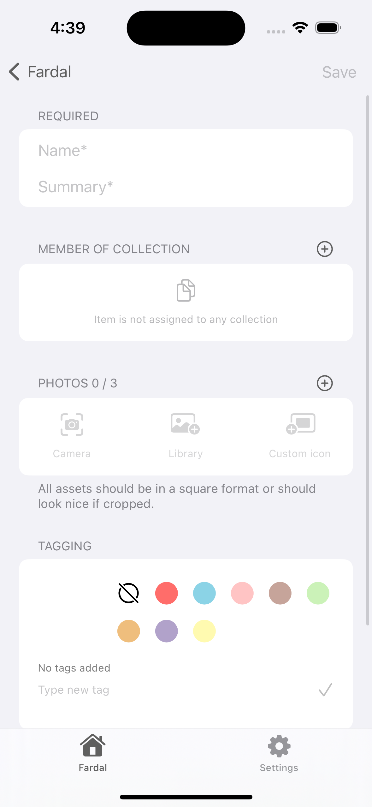
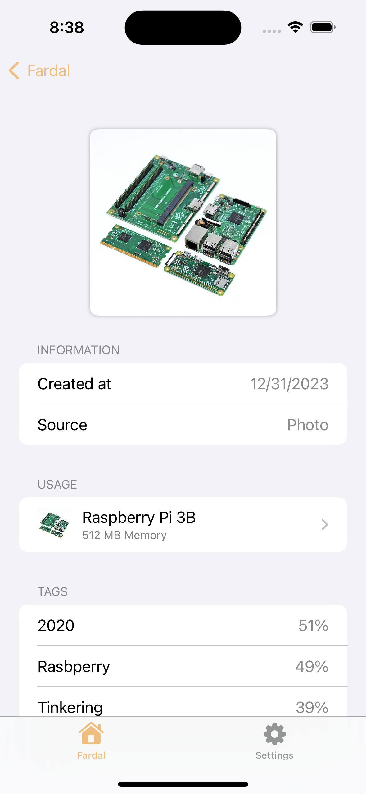

# Fardal
> SwiftUI and SwiftData based inventury app for collectors and anyone else who needs some list of stuff they own.
> Currently it is in active development and works as a playground for myself. Please do not use it.

 ## Build status

|Service|Status|
|-------|------|
|-|-|

## Requirements
- Xcode 15+
- iOS 17+
- Swift 5.9

## Build tooling
To have a versioned build phase tooling chain, the app uses [`mint`](https://github.com/yonaskolb/Mint) to have a defined version set of tools. 

## Tech stack
`Fardal` is meant to be 100% Swift and dependency-free app. It uses Swift, SwiftUI and SwiftData to be implemented. Simple external dependencies like a helper to work with `SFSymbols` are in use.

Besides this, the app should only be designed using 100% stock controls. Additional styles for buttons or text are only allowed if the do not have any fallback to `UIKit` or other `inspect`-ion helpers to achieve the design.

In later versions, Fardal could contain other Apple fameworks like `MLKit`.

## Build tooling
|Name|Configuration file|
|-|-|
|SwiftLint|`.swiftlint`|
|SwiftFormat|`.swiftformat`|

## How to run
Because of the SwiftUI Preview feature, mint will not run during build time. It would run every Preview refresh which lets Xcode crash.

The `SwiftFormat` command will be currently triggered by a shell command:
```shell
mint run swiftformat .
```

## Blockers fixed
### Version 0.0.1
I'm struggeling hard to get the `SwiftData` with inter-model relationships working. The unnamed Xcode crashes with no helpful stack-trace are a real bummer to continue with this app.

## How it looks
### Version 0.0.1

**Row contents**
1. Dashboard in empty and filled
2. Collection detail in read and edit mode
3. Item detail in empty and read mode
4. Misc. views like custom pickers or other detail views

| | | | |
|-|-|-|-|
|||
||||||
|||||
|||


## Used dependencies

|Name|Will be replaced by own code|
|-|-|
|[SFSafeSymbols](https://github.com/SFSafeSymbols/SFSafeSymbols)|no|
|[SwiftUI-Flow](https://github.com/tevelee/SwiftUI-Flow)|yes, it will be replaced with `FlowRowLayout`|

## Keep in mind

### Not production ready
This app is purely build for having fun! All features have room for improvements or could be done more elegant. This app was and will be never meant to run in production-like environments. Learning is fun!

### Thanks to
- shinnayu from the iOS Development Discord

## License
This project is licensed under the MIT License - see the [LICENSE](LICENSE) file for details.
Dependencies or assets maybe licensed differently.
